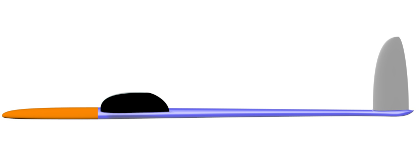
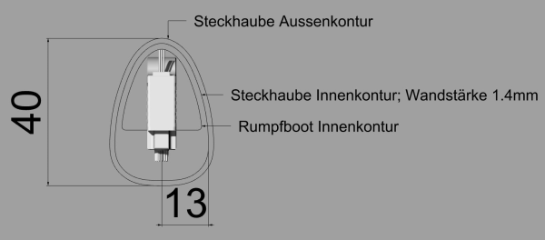
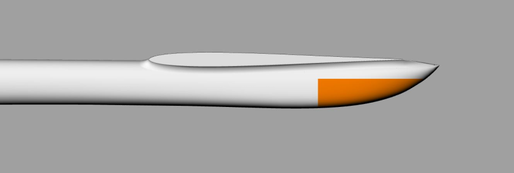
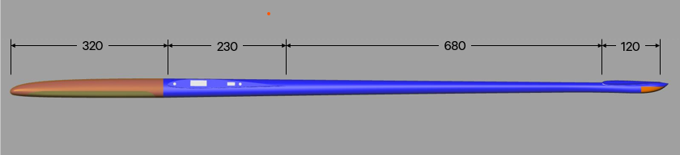
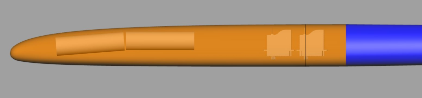
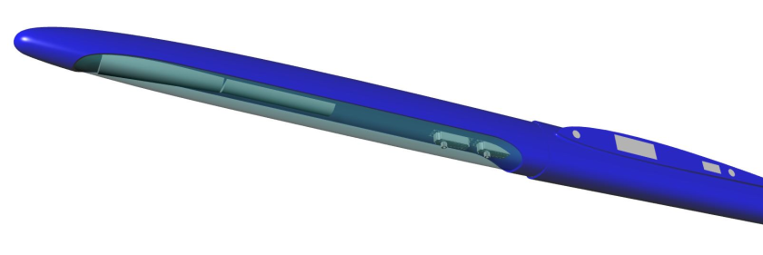

# Project VJX - Fuselage Design 

First of all, we thought about in which direction the design of the fuselage should go. Should it become a bit more voluminous in order not to wrench the fingers too much during RC installation and perhaps also have space for a fuselage ballast? Or should it be as compact as possible to reduce the projected frontal area and also the washed surfaces? 

A thicker fuselage would have the advantage that it is easier to get it stiff enough with less material use, but a slim fuselgae looks better and should not be heavier despite more material use. By "more material input" I mean the total sum of needed fabric in g/m². 

Jochen has placed great emphasis on drag minimization in the aerodynamic design of the airfoils. In the end, we wanted to continue this with the fuselage ... 
The cross-section of the current Vantage fuselage is somewhere between Freestyler5/6 and Pitbull2 and therefore already relatively slim. So this is a good starting point for the VJX fuselage. The 12mm servo class (e.g.  KST X12 / MS320) is currently increasingly used as servos. Recently, however, there are also smaller servos from KST and MKS, which are also very well suited for the V-tail unit. I am thinking of MKS HV75k or KST HS-08. On this type of slim servos we put the focus. 
But I tried to design the height of the fuselage in such a way that the 12mm servos can still be installed. But then the boat of the fuselage must be provided with cut-outs, as with the Pitbull2. Compared to the Vantage, the VJX fuselage has now shrunk by 2mm in height, the overall width has remained the same. 
Following  the cross section of the Vantage with 42mm height at the transition hood / fuselage and the cross section of the VJX fuselage with KST X12 servos …
 

and here the VJX fuselage with KST HS-08:

 
The wall thickness of the plug-in hood was chosen deliberately quite high, because it absorbs very high forces in unclean landings and must be built accordingly. 

The linkage of the V-tail rudders is extremely important, especially for fast F3x times. Experience shows that modern F3F models are very sensitive to elevator deflections, or in other words, they the models are flown with very little deflections. At the same time, the steering should remain stiff. A steering that is too soft or can’t be finely dosed enough will eventually become unflyable! Keep in mind that the models must be flown very (!) close to the ridge of the slope. You can help yourself here by using high-resolution  and accurate servos on the one hand, and/or by making the lever lengths on the tail rudder as long as possible. For this reason, many fuselages have this knob under the tail. Also VJX:

So, now the different dimensions would be interesting. The root chord length of the wing is already specified at 230mm. The tail has a chord length of 120mm. Exciting is the question of how long the nose the fuselage should be and how long the lever arm should be behind the wing. In my opinion there is no perfect F3f value for both the length of the nose and the length at the back, but a certain range that works by and large. 
However, since one must inevitably commit to a value, you should think about what I expect from the model. Both lengths have a strong effect on flight behavior... The longer the nose and the back lever arm tube, the more stable the model will behave around the vertical axis. For VJX, we have chosen the values a bit from the gut.

With the length of the fuselage tube we got stuck at 680mm. This is shorter than Pitbull2 and Vantage, but longer than the freestylers. 
At the front, the trend is currently towards significantly shorter noses. An extreme example is the Pitbull3 with maybe 260mm length in front of the wing. We also follow the trend, but not nearly as extremely. The VJX has a length of 320mm at the front. On the one hand, this should be short enough, for fast and tight turns and, on the other hand, in combination with the (little bit shorter) length of the fuselage at the back and the classic dimensions of the tail fine for a stable straight-line flight, especially at fast times: 

Whether the fuselage is visually pleasing or not, is of course a matter of personal taste. But I think it fits well into the overall low drag concept of VJX. The fact that certain restrictions in the selection of RC components are associated with this design, is in the nature of things:
 

 
Mario 

