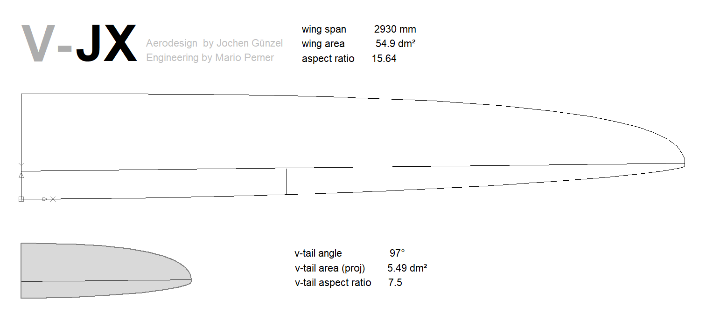
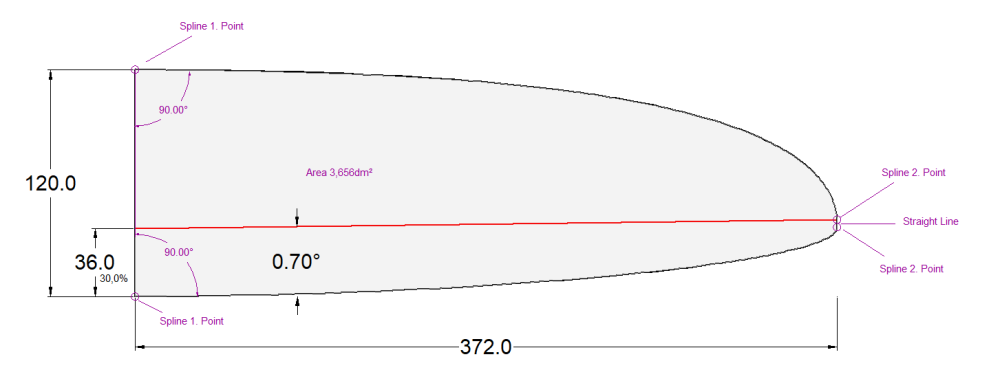
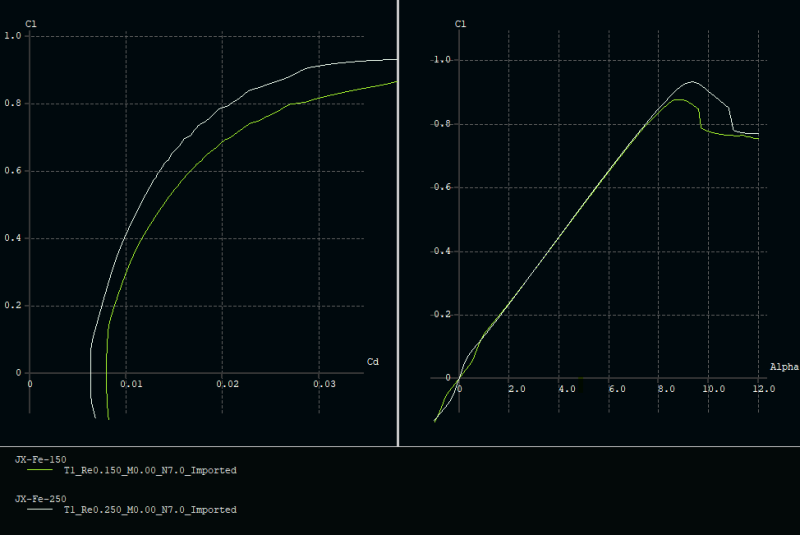
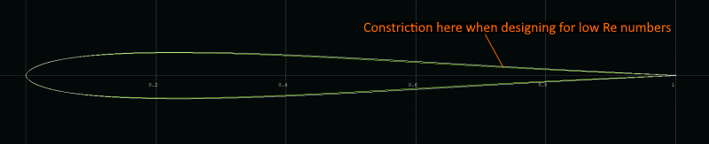

# Project V-JX - Tail Design

For the design of the tail wings, proven empirical values were largely used - i.e. initially no experiments in order not to introduce further risk variables into the overall system "V-JX". 

With the rather small v-tail angle of 97 degrees, the emphasis is placed on good directional stability and damping around the vertical axis. Typically, the v-tail angle of F3F models is between 97 and 102 degrees. I was happy to follow the recommendation of Mario, who is a convinced 97 degrees fan ...

With the default value of 10% projected area to the area of the wing, this results in 5.49dm² of projected area for the tail unit. With the opening angle of 97 degrees, we get 7.31dm² of total area of the v-tail. The root chord length was set to 120mm to indirectly get a sufficient good aspect ratio (impacts induced drag). Currently all v-tails do have a root chord length between 120 and 130 mm. Like the wing, the rudder line got a small swept forward of 0.7 degrees, mainly to make the wing and tail appear to be "one piece". 

With these specifications, further artistic freedoms are already set tight limits. The further tail contour was therefore defined directly in CAD.  An optimization of the chord length distribution with FLZ_vortex was omitted, since the desired "optical shape similarity" of the wing and tail unit automatically results in a sufficiently healthy lift distribution.

### Rudder chord length

When determining the percentage rudder cord length, a weighing up or a compromise between the advantages and disadvantages of smaller or larger rudder chord length must be found. 

|  Advantages large rudder chord length | Advantages small rudder chord length   |
|---------------------------------------|----------------------------------------|
| high effectiveness for small deflections | potentially longer undisturbed laminar flow |
| more height of the rudder box, easier to build, higher stiffness of the rudder |	larger deflections - less sensitive to play in the rudder linkage, smaller rudder horns |
 
The rudder chord length was finally set at a rather generous 30%. 
(A little anticipation: The fuselage will get a hump at the tail to be able to use longer rudder horns)

This completes the design of the wing plan:

## Airfoils

As part of the development of the JX-GS airfoil family, a mini airfoil family JX-Fe was also developed for the tail wing.  

The two airfoils have been optimized for use with V-JX with regard to low drag between cl  0.0 – 0.4 with simultaneous robust max angle of attack.  The root airfoil has 7.2% thickness, the tip airfoil  7.0% thickness. 
 

Since symmetrical profiles require a "constriction" in the rear profile area for the lowest drag with decreasing re-numbers, the root airfoil benefits from its higher re-number design with a larger thickness at the rudder box (good for the linkage...).

 

Both airfoils together with some polars can be found [here](https://github.com/jxjo/Airfoils/tree/main/JX-Fe).

## Xfoil/Xflr5 Special

*So that it does not remain too superficial or even boring 😉, I’d like to make a sidetrack to a little xfoil peculiarity:*

*The story started when I discovered a very small bump at cl=0.5 in the cl(cd) polar of an airfoil. Mmh. Even after changes in the alpha sequence used to calculate the polars, the small bump remained in place. The surface of the profile was perfectly smooth. That's impossible! – my curiosity was awakened …
In search of the cause, my gaze finally got stuck on the transition curve xtr bot (cl). The small bump happens just at the cl value at which the transition point at the bottom side reaches the trailing edge.  Ok. But why?
As a test, I gave the previously sharp edged airfoil a small trailing edge gap and lo and behold, the small bump was gone. That had to be the track!  But first, a little theory:*

*In the xfoil calculation of the circulation (-> lift), the trailing edge is of particular importance. There, the Kutta condition applies:*

    The sharp trailing edge of a wing is not flown around, but the adjacent flow flows smoothly there. In an adjacent flow over a two-dimensional body with a sharp trailing edge, a circulation builds up that is just large enough that the rear stagnation point is at the trailing edge. 

*Important in this context is the phrase "sharp trailing edge".  In the case of a trailing edge gap, Xfoil inserts an additional panel to close this gap and also to meet the condition of a closed airfoil. Obviously, this blunt trailing edge leads to a modified algorithm for calculating the circulation and also to the tricky question of how different states laminar-turbulent on the top and bottom at the trailing edge are merged.*

*And indeed: In the Xfoil routine on the influence of the TE (trailing edge) you will also find this line of code:*

	`SHARP = DSTE  .LT.  0.0001 * CHORD`

*i.e. Xfoil treats all trailing edge gaps < 0.01% as "sharp" – larger gaps are "blunt". In the case of "blunt", a vortex strength is applied to the final panel, which then influences the overall circulation of the airfoil. The differences are negligible in normal profile calculations – except*

-	*in the calculation of the moment coefficient cm, where the changed pressure distribution at the trailing edge due to the long lever arm has a strong influence on cm  (important for  the evaluation of wing-only airfoils).*
-	*in the case of symmetrical profiles and lower re-numbers, where detachment bubbles at the trailing edge cheerfully move between the top and bottom and contribute to the "dead band effect".  The effects become much smaller with a small trailing edge gap.*

*As a former protagonist of a sharp trailing edge, I am now remorsefully purified and now set the "TE gap" to a safe 0.03% in all my airfoil  calculations and comparisons. Well, nature has it much easier here. It simply lets the air flow over the trailing edge as if there were nothing there. If she knew how complicated it actually is...* 😉

### Tail design completed 

This completes the design of the tail and all data is ready for 3D CAD.

