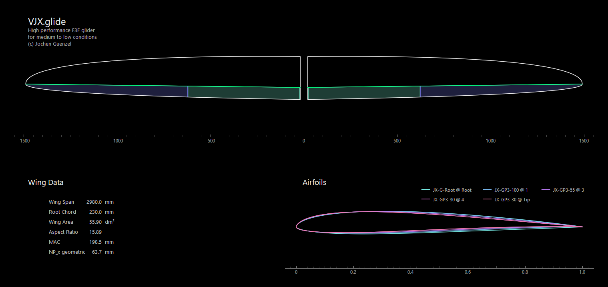
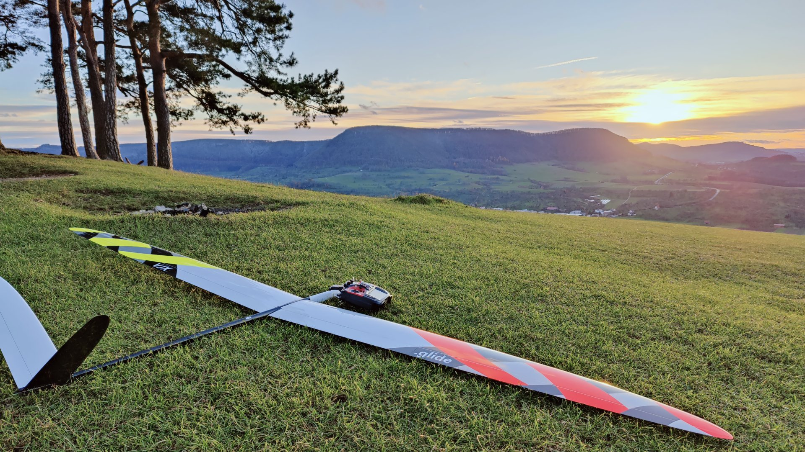

# VJX.glide

The VJX.glide wing complements the original VJX in medium to low conditions.

Main design objectives:

- Best performance within an F3F flight time range of 45–60 seconds.
- High maximum lift reserves to allow hard, energy-efficient turns.

The differences between the various VJX wings can be taken from the following comparison table:

 

Flight reports from numerous pilots now confirm that the desired handling characteristics have been achieved exceptionally well.

A detailed description of the design considerations behind the VJX.glide can be found [on RC-Network](https://www.rc-network.de/threads/projekt-vjx-glide.11961376/).

In 2025, the original JX-GP airfoil family was completely revised and is now called JX-GP3. The updated airfoils, along with a more detailed description, are also available [on GitHub](https://github.com/jxjo/Airfoils/tree/main/JX-GP).

### Content of Directory 

- The airfoil family JX-GP3: `JX-GP3-100.dat`, `JX-GP3-55.dat`, `JX-GP3-30.dat`
- A root airfoil `JX-G-Root.dat` that ensures a compatible wing section at the wing root
- The [PlanformCreator2](https://github.com/jxjo/PlanformCreator2) project file, which allows generation of intermediate wing sections and a draft wing planform as a DXF file
- In the subdirectory `./dxf_airfoils`, you'll find a DXF of the wing planform and all airfoils prepared with a trailing edge thickness of 0.3mm, ready for import into CAD

---
### Gallery
 

VJX.glide waiting for clearance at Teck 

---

Have Fun! :wink:

Jochen Guenzel 
2025