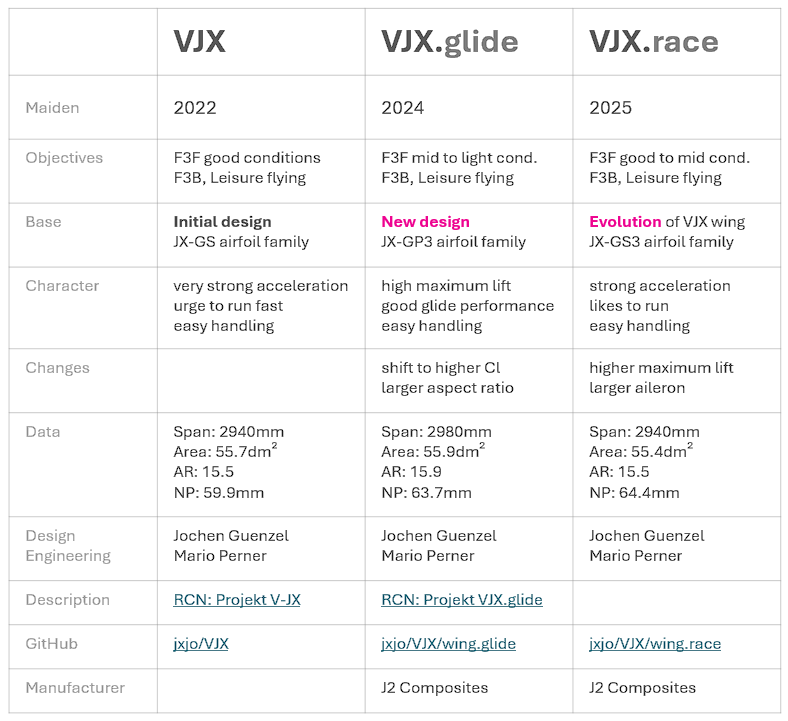
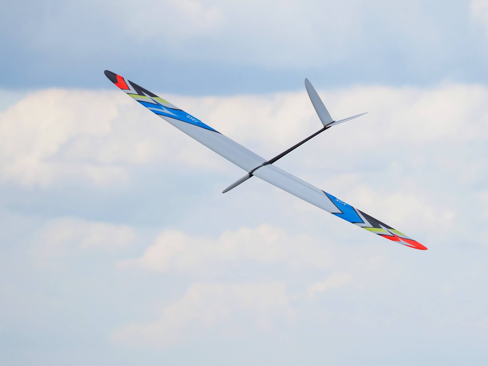
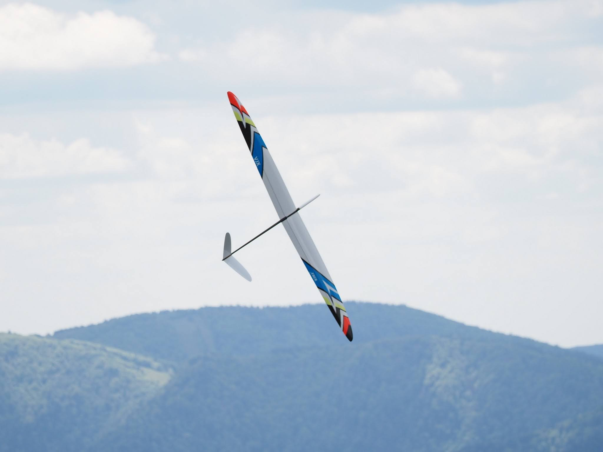
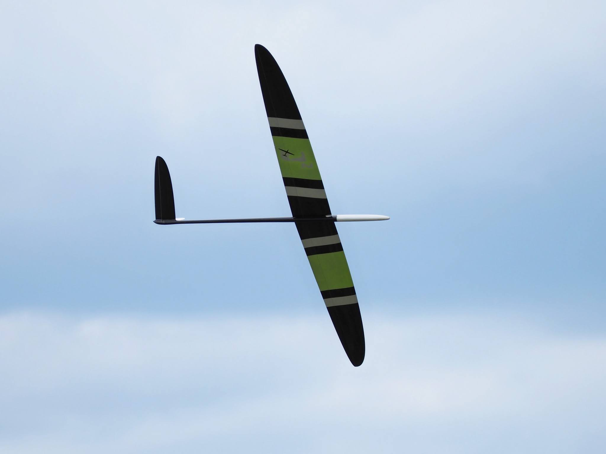
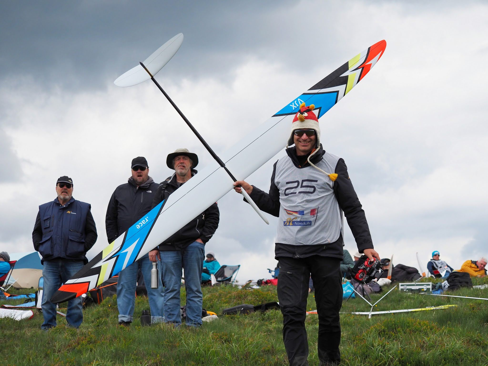

# VJX.race

The VJX.race wing is a careful evolution of the original VJX. 

Based on numerous observations at competitions the design objectives for this revision were:

- Improved higher lift reserves to have more room to maneuver in tight turns.
- Enlarged ailerons with more relative width towards tip for further improved agility.
- Slightly decreased performance at Cl close to 0.0.

For the new wing, the airfoil family JX-GS was revised to achieve these characteristics. In 2025, a further refinement focused on geometric aspects resulted in the JX-GS3 family, published [on RC-Network](https://www.rc-network.de/threads/jx-gs3-strak-f%C3%BCr-sehr-schnelle-hang-segler.12079061/) and available with detailed documentation [on GitHub](https://github.com/jxjo/Airfoils/tree/main/JX-GS).

The differences between the various VJX wings can be taken from the following comparison table:

 

### Content of Directory 

- The airfoil family JX-GP3: `JX-GS3-100.dat`, `JX-GS3-50.dat`, `JX-GS3-30.dat`
- A root airfoil `JX-G-Root.dat` that ensures a compatible wing section at the wing root
- The [PlanformCreator2](https://github.com/jxjo/PlanformCreator2) project file `VJX.race.pc2`, which allows generation of intermediate wing sections and a draft wing planform as a DXF file
- In the subdirectory `./dxf_airfoils`, you'll find a DXF of the wing planform and all airfoils prepared with a trailing edge thickness of 0.3mm, ready for import into CAD

---
### Gallery
     
  

VJX.race in contest - Photos courtesy of Pierre Rondel

---

Have Fun! :wink:

Jochen Guenzel 
2025