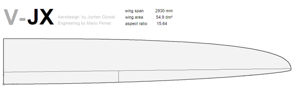
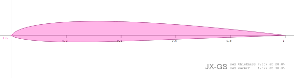
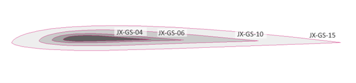

# Project V-JX - Wing Design Part 1

## Key design data of the wing 

Since the wing should first be evaluated with a Vantage fuselage, the chord length at the root is specified as 230mm, which is also a good average. Practically all current F3F models are in a range between 225 - 235mm at root.

Maneuverability is one of the important design goals, the half-span was set at 1450mm - with fuselage this results in a total span of approx. 2930mm. This value is rather at the lower end in comparison to most of the current F3F models..

(*Off topic: Perhaps even more important in setting the wingspan was that the wing just fits into the trunk without moving the passenger seat*) 

Wing area and thus aspect ratio will result from the determination of the chord length distribution along wingspan in one of the next steps.

## Airfoil family JX-GS

All the airfoils of the wing can be found [here](https://github.com/jxjo/Airfoils/tree/main/JX-GS). Development of the JX-GS airfoil family (in Geram we use the term "Strak") was done in several iterations and was described in detail in [Entwicklung eines F3F-Profils]( https://www.rc-network.de/threads/entwicklung-eines-f3f-profils.787618/). This thread on RC-Network has also become a great fund for questions about airfoil development due to the numerous discussion contributions.

Therefore, at this point only a short summary of JX-GS:

-	Fast slope airfoil - especially for F3F
-	Design objective: "Robustness" in turbulent flow conditions on the slope
-	Pronounced flap airfoil with low camber: speed position at 0 degrees, fast gliding with 0.5 - 1 degree flap position
-	The airfoils are "synthetic" - they were created by [Xopfoil-JX](https://github.com/jxjo/Xoptfoil-JX/releases) without a human touch on the airfoil surface

The name of the individual airfoils gives an indication of their optimal conditions of use within the wingspan - see [here](https://github.com/jxjo/Airfoils/blob/main/JX-GS/readme.md). 
Drawing the individual airfoils with their optimal chord length, shows the wide range of chord this airfoil family covers at a wing:

## next: [Wing Design Part 2](wing_design_2.md)

