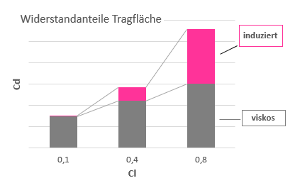
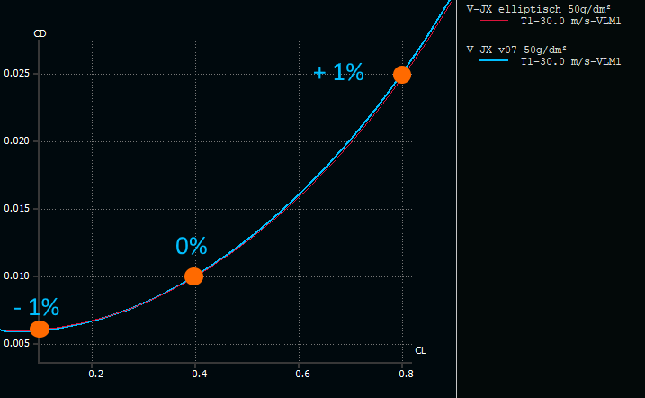
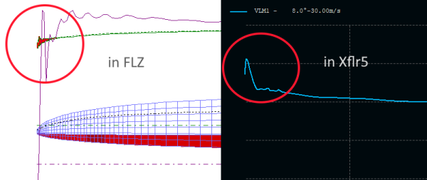
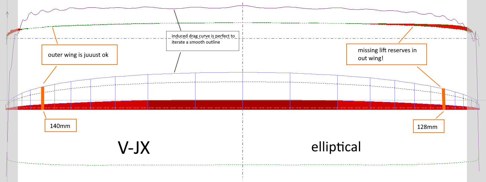

# Project VJX - Wing Design Part 2

## Wingplan - chord length distribution

Beside airfoil characteristics, the chord depth distribution along the wingspan has the greatest influence on the properties of the wing. It determines decisively 

-	lift distribution and thus the induced drag, especially at higher lift coefficients 
-	lift safety margin in the outer wing for good-natured behaviour at flight limits

Unfortunately, both properties are in competition, so it is important to find an optimum according to the requirements profile. Since finding this individual optimum is probably the most important design task in wing design, it will be discussed in more detail below.

## Induced drag - elliptical lift distribution 

Since the induced drag grows square to the lift coefficient, it affects particularly the total drag of the wing at high lift values. In the F3F flight task, this is the short but crucial section of the turn, which is typically flown with a Cl between 0.6 and 0.8 (see also the results of [real flight measurements](https://www.rc-network.de/threads/flugvermessung-bei-f3f.11812891/post-12099993) - sorry in German). 

If the induced drag (and thus the total drag) in the turns should be reduced as an optimization goal, our wing should have an elliptical lift distribution, which corresponds to an elliptical chord length distribution in first approximation. 

How much would be the improvement of such an optimization in terms of induced drag? 

The graph compares two wings, one with elliptical and one with "quite elliptical" (= slightly super elliptical) chord length distribution, such as VJX. 

The calculated possible improvement of a strictly elliptical chord length distribution of 1.0% at Cl=0.8 is quite a typical value. We should keep this value in mind when it comes to discussing the necessary lift reserves in the outer wing later.

The slightly improved drag of the super elliptical wing at low Cl values is remarkable. Without further examinations, I suspect the higher Re numbers and thus lower airfoil cd values for a "fuller" super relliptical wing are the reason for this effect.

## What to do with the outermost wing tip?

Before we turn to the lift distribution and the lift reserves, a brief consideration of the outermost wing tip, i.e. the last 2-5 centimeters of the wing. 

For a long time I struggled with the typical "artifacts" of lift and drag values at the wing tip ... 

... and tried unsuccessfully to master them. At the tip of the wing it becomes somehow special:

-	due to the very low chord length, the Re number goes well below 50,000. In this area of low re-numbers, the calculation methods implemented in Xflr5 or Flz_vortex are increasingly failing. The calculated results are very "questionable".
-	Due to the pressure compensating flow between the bottom and top surface, 3-dimensional effects (cross flow) come into play, which cannot be covered by our simple calculation methods.

So, what to do? I choose the simplest solution: "Ignore! That will work...". In the following considerations, the last centimeters of the wing are left out. The shape of the outer tip will be shaped only from a purely esthetic point of view. 

## Chord length distribution - lift and lift reserves 

After considering the drag of the wing, it is now time for the lift distribution along the wing. Two main objectives are pursued:

1.	A uniform, constant course of the local lift coefficient with a slight increase towards the middle of the wing
2.	Stall at high angles of attack should happen first towards root of the wing to avoid uncontrolled "Abschmieren" (German phrase). Conversely, the last third of the wingspan should have certain lift reserves. 

The local lift coefficient and local max angle of attack influenced by

-	the airfoil ... 
-	the local chord length and thus the Re number 
-	the effective local angle of attack as the sum of the angle of attack of the wing and induced angle of attack at this section (which is negative) 
 
Regarding the above influence of the airfoil, a short bridge to the airfoil family ("Strak") should be made: A good strak is characterized, among other things, by the fact that the airfoils towards wing tip, i.e. with a smaller re-number, can go along with their the alpha the inner airfoils:

 
Equipped in this way, we go to work in Flz_vortex, which is better suited than Xflr5 for this work step. It starts with the basic dimensions, root chord length and wingspan, and an elliptical chord length distribution...

My approach to the wing design with Flz_vortex is 

-	straight, horizontal trailing edge (reference line for swept is 100% chord) 
-	not too many (effort!), not too few (accuracy!) wing segments. Width of segments decreasing to the wing tip
-	the inner 2 segments are as wide as the (considered later) flap
-	the right half wing is the reference wing (e.g. elliptical chord length distribution), the left half wing is then iterated and optimized
-	the calculated curve of induced drag is ideal for creating a continuous outline because it is sensitive to changes in the chord length gradient
-	When the changes made to the chord length become smaller then +-0.5mm, iteration is finished. 

After a few iterations, the preliminary interim result is ready. An idealized wing with the desired lift distribution, slightly super elliptical and with slightly increased induced drag (about 1% at Cl=0.9 - see view above) compared to an elliptical wing planform. 

Interim conclusion: The base design of the cord length distribution is relatively "sharp" with only a few lift reserves in the outer wing. Regarding lift reserves, however, an adapted flap depth should give an extra push... More on that later. 

In the next part, we first compare the chord length distribution of VJX with other, current F3F models and then take a closer look at the rudder depth distribution along wingspan. 

## next: [Wing Design Part 3](wing_design_3.md)

