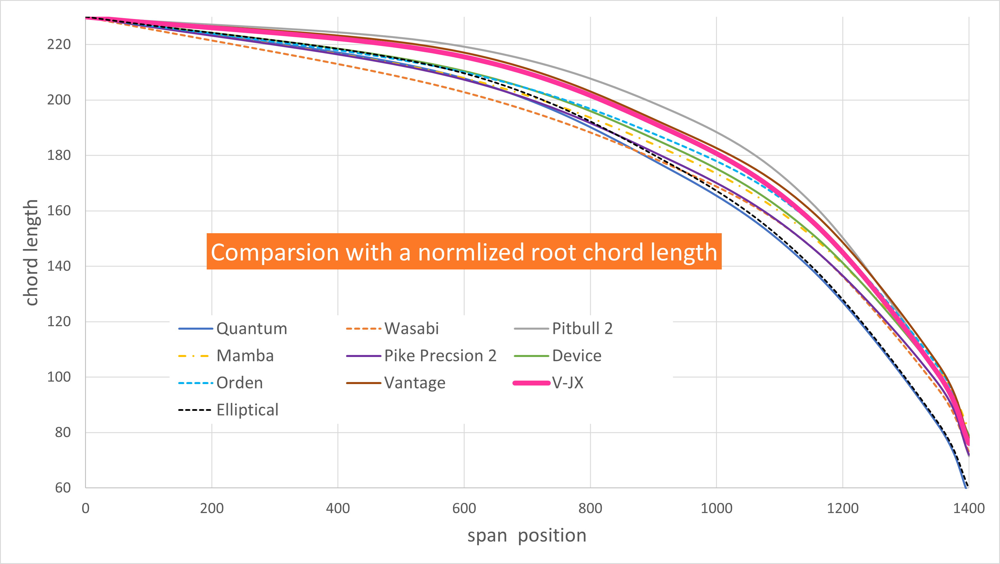
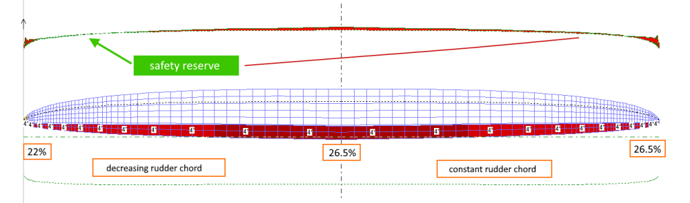
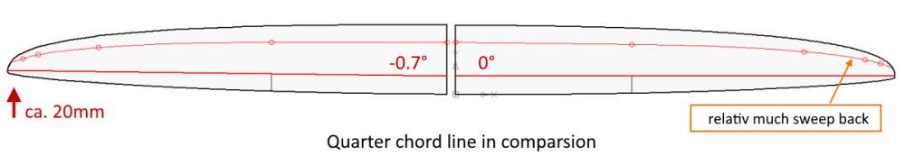

# Project V-JX - Wing Design Part 3

## Chord length distribution - Verification 

So far, a lot has been calculated, iterated and also some assumptions were made. But where do we stand with our draft? Are we on the right track? 

One of the few ways to answer these questions is to check whether the current design is in the design corridor of successful F3F models described above. If so, we can at least assume with some certainty that we are not entirely wrong...

For this purpose, the depth distribution of some current F3F models was measured from the published side views and scaled to the wingspan and root chord length of V-JX. 

Comparison of the normalized **approximate** chord length distribution of current F3F models. The edges of the design corridor form Quantum, with almost elliptical chord length distribution and Pitbull 2 with strong pronounced super elliptical distribution.

Conclusion of the verification: That fits. Keep it up!

Based on the chord length distribution found, it can now go to the last important design step: 

## Rudder chord length distribution

As a pronounced flap airfoil, the JX-GS "lives" on the use of the flaps. That means, flaps are always more or less deflected - except perhaps for a short period time on a high speed straight line course. Even if it's almost trivial, first a list of the tasks or requirements for the "flap concert" of the (inner) flap and (outer) ailerons in order to keep an eye on the various aspects.

1.	Static adaptation of the wing polars to the flight conditions: Up to mediumn conditions  , both flaps should be uniformly positively deflected (0.5 to 2 degrees). In very good conditions, the flaps are in the zero position.
2.	Improvement of the high-lift properties in the turns by use of snap flap. 
3.	Good to very good maneuverability around the longitudinal axis due to well sized ailerons
4.	Very good effect of the flaps for landing - butterfly setting
5.	Improvement of the lift reserves in the outer wing at high Cl values by geometric twist with a reduced rudder chord length 

In doing so, the basic consideration must be made:

-	large rudder chord length, high impact, smaller deflections, lower drag increase
vs.
-	smaller rudder chord length, no early disruption of the laminar flow by the rudder gap

In consideration of the aspects, the rudder chord length at the root was set at 26.5%. Comparable F3F models are in a range of 25% - 28%.

Trickier is the question of whether the rudder chord length should taper along wingspan or remain constant? A decreased rudder chord length results in a geometric twist that leads to a changed lift distribution (see chapter above "Chord length distribution - lift and lift reserves")

Since "good-naturedness" - here avoiding tip stall during fast flown turns - is one of the important design goals, a slightly decreasing rudder depth towards wing tip was finally defined. 

In Flz_vortex, the effect of a decreasing rudder chord length can be well visualized:

## Swept rudder hinge line

The rudder or hinge line is the only straight reference line of the wing. With the defined section and rudder chord length distributions, the shape of the wing is already geometrically determined. 

The angle of the rudder line determines sweep back of the wing where the rudder line is the reference line. The 0-degree hinge line used in many F3F models results in a remarkable sweep back of the wing...

 
... which in turn results in more torsional load on the wing (ideally, the quarter chord line should be straight and horizontal). For this reason, the hinge line was slightly moved forward by 0.7 degrees.  

*The second reason: It just looks prettier to me!
Whether such small swepts of the rudder line have a significant influence on flight mechanics could not be researched so far. The majority of the current F3F models have a 0-degree hinge line.  On the other hand, "Orden" and especially "Shinto" have a clear "swept forward" of 1.5 and 2 degrees respectively. There seems to be a slight tendency.* 

In the [data subdirectory](data) you'll the FLZ_vortex project file with the comparison of V-JX to an elliptical wing.

In the 4th and final part of the wing design, we take a look at the performance of the wing in Xflr5 in order to finally determine the wing plan including the position of the airfoil sections. 

## next: [Wing Design Part 4](wing_design_4.md)