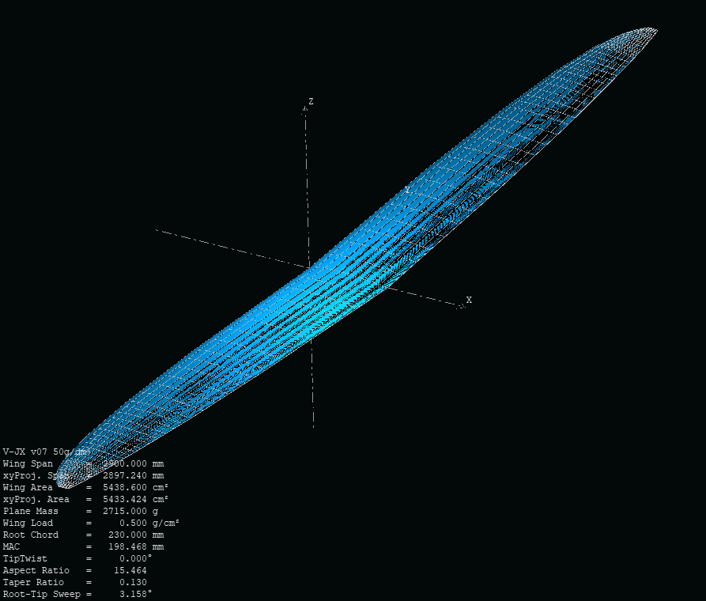
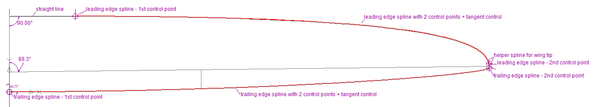
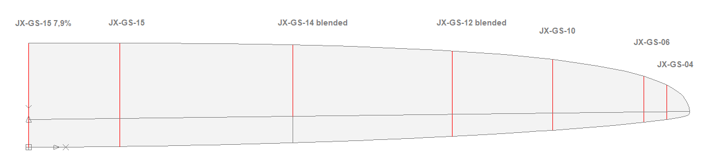

# Project V-JX - Wing Design Part 2

## Wing aerodynamic calculation with Xflr5

Actually, we would now have all the data to define the wing in Xflr5 and perform an aerodynamic calculation. Unfortunately, Xflr5 cannot automatically determine the intermediate sections resulting from the segmentation of the wing. Therefore, a decision has to be made between 

1.	A very simplified wing with only 3 trapezoidal segments for the 4 existing profiles of the airfoil family. However, this results in a high deviation from the previously elaborated chord length distribution within the sections ...
2.	Define more wing segments and distribute the 4 airfoils as well as possible. This is better or more accurate than variant 1 - but may not do justice to the airfoils.
3.	Define more segments and calculate the additional necessary intermediate airfoils.

We opt for variant 3. However, this can hardly last long without machine support. The manual click effort quickly becomes very high, especially if the wing should be calculated with deflected flaps or other airfoil variants.

*Often you get to the point where you say, "I don't care anymore - this wing will fly somehow!" In such a situation only a soothing cup of tea may help...*

Fortunately, there is the small tool Xfoil_Worker which is part of the [Xoptfoil-JX package](https://github.com/jxjo/Xoptfoil-JX/releases) which allows, packed in a batch job, to automate some work steps: 

-	Creating intermediate airfoils by blending two basic airfoils
-	Setting flap on an airfoil - for simplicity, however, a constant flap chord length of 25% has now been defined
-	Create the necessary Xfoil polar sets for all airfoils used in the wing.   
 
Both the generated airfoils and all associated polars can then be read into Xflr5 in one go, so the wing analysis can then be started directly afterwards.

A note on the mixing or blending of two similar airfoils to create a new intermediate airfoil: It is astonishing - or not - how geometric mixing also "mixes" the aerodynamic properties of the two profiles in the same proportion. Nice.

Finally, the wing appears on the screen in all its beauty ...

... and the calculations can start. Important: Since only the wing has been modeled so far, the results are only suitable for qualitative or comparative studies, such as the effect of different chord length distributions. If the wing area of a variant changes, the weight must be readjusted in order to keep the wing load of the wing variants constant. 

In this brief design description, an analysis and discussion of different polars and key figures along wing span is omitted. You'll find the Xflr5 project file in the data subdirectory.

## Final 2D wing plan

The design work has now been completed. With the 2D wing plan, the final "look" of the wing is defined in this last design step.

It would be nice if the wing could have a certain individual look compared to the common designs and of course also finds favor in the eyes - at least - of the designer.

Artistic freedom in outline design is subject to very narrow limits due to the specifications that have already been made:

-	Chord length distribution
-	Rudder chord length distribution
-	Swept angle of the hinge line
 
In addition, the curvature of the wing outline should be as steady as possible in order to avoid artifacts in the subsequent 3D-design.

First, the wing segment geometries are transferred from Flz-vortex to 2D CAD. Splines are then used to try to form a wing outline that comes as close as possible to the segment geometry. For a harmonious curve progression, the splines should have as few control points as possible. Therefore, the splines have only 2 control points which define slope and curvature of the spline.  The wing tip gets its final shape with an additional, helper spline. 

After this optical fine tuning, the rudder chord length no longer decreases linearly from the root to the wing tip, but is practically constant up to the aileron and then decreases to the wing tip. 

   
Now only the airfoils are missing. 

For 3D design, it is recommended to work with a few additional airfoil sections to ensure that "overlaying" the surface in 3D does not lead to geometric distortions of our airfoil strak. For the wing root, the basic profile JX-GS-15 was slightly thickened to 7.9% to support statics and to become a little more variable in terms of wing connector height:

Ok! Everything should be ready for 3D CAD design ...  

